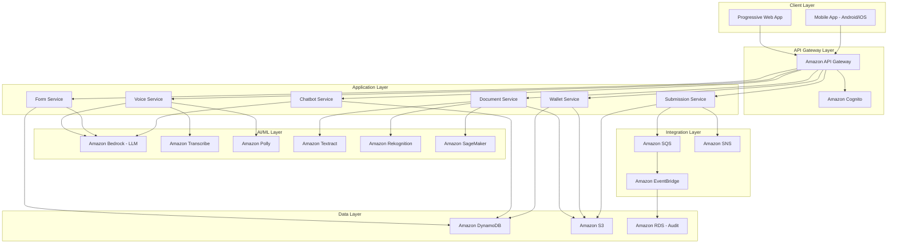

# Design Document: AadhaarAccess AI Platform

## Overview

AadhaarAccess AI is a cloud-native, AI-powered platform built on AWS infrastructure that enables rural and remote populations to complete Aadhaar updates remotely. The system leverages AWS AI/ML services including Amazon Bedrock for conversational AI, Amazon Transcribe for speech-to-text, Amazon Polly for text-to-speech, Amazon Textract for document OCR, and Amazon Rekognition for document verification. The architecture follows a microservices pattern with clear separation of concerns, ensuring scalability, security, and maintainability.

The platform provides a mobile-first progressive web application (PWA) that works across devices, with offline capability for data capture and online processing for AI-powered features. All user data is encrypted at rest and in transit, with compliance to Indian data protection regulations including the Aadhaar Act 2016 and IT Act 2000.

## Architecture

### High-Level Architecture



### Component Architecture

The system is organized into six primary microservices:

1. **Voice Service**: Handles multilingual voice interactions using Amazon Transcribe for speech-to-text, Amazon Polly for text-to-speech, and Amazon Bedrock for natural language understanding
2. **Form Service**: Manages conversational form guidance and validation using Amazon Bedrock for intelligent question generation
3. **Document Service**: Processes document uploads using Amazon Textract for OCR and Amazon Rekognition for quality and fraud detection
4. **Submission Service**: Handles secure submission to Aadhaar centres with encryption and retry logic
5. **Chatbot Service**: Provides contextual help using Amazon Bedrock with RAG (Retrieval Augmented Generation)
6. **Wallet Service**: Manages secure document storage with encryption and lifecycle management

### Data Flow

1. User authenticates via Amazon Cognito with Aadhaar OTP verification
2. User initiates session through voice or text interface
3. Voice input is transcribed by Amazon Transcribe and processed by Amazon Bedrock
4. User uploads documents which are stored in S3 and processed by Textract/Rekognition
5. Extracted data auto-fills form fields managed by Form Service
6. User confirms submission which is encrypted and queued in SQS
7. Submission Service processes queue and transmits to Aadhaar centres
8. Status updates are sent via SNS to user's registered mobile number

## Components and Interfaces

### 1. Voice Service

**Responsibilities:**
- Speech-to-text conversion for 12 Indian languages
- Text-to-speech generation in user's preferred language
- Voice command interpretation and intent recognition
- Audio quality enhancement for noisy environments

**Key Interfaces:**

```typescript
interface VoiceService {
  // Transcribe user speech to text
  transcribeAudio(
    audioStream: ReadableStream,
    languageCode: LanguageCode
  ): Promise<TranscriptionResult>;
  
  // Convert text response to speech
  synthesizeSpeech(
    text: string,
    languageCode: LanguageCode,
    voiceSettings: VoiceSettings
  ): Promise<AudioStream>;
  
  // Detect user's language preference
  detectLanguage(
    audioSample: Buffer
  ): Promise<LanguageCode>;
  
  // Process voice command and extract intent
  processVoiceCommand(
    transcription: string,
    context: SessionContext
  ): Promise<CommandIntent>;
}

interface TranscriptionResult {
  text: string;
  confidence: number;
  alternatives: string[];
  languageCode: LanguageCode;
}

interface VoiceSettings {
  speed: number; // 0.5 to 2.0
  volume: number; // 0 to 10
  voiceId: string;
}

type LanguageCode = 
  | 'hi-IN' | 'en-IN' | 'ta-IN' | 'te-IN' 
  | 'bn-IN' | 'mr-IN' | 'gu-IN' | 'kn-IN'
  | 'ml-IN' | 'pa-IN' | 'or-IN' | 'as-IN';
```

**AWS Services Used:**
- Amazon Transcribe for speech-to-text with language identification
- Amazon Polly for text-to-speech with Neural TTS voices
- Amazon Bedrock (Claude 3) for intent recognition and natural language understanding

### 2. Form Service

**Responsibilities:**
- Manage form state and validation
- Generate conversational questions based on update type
- Validate user inputs against business rules
- Auto-save session progress
- Integrate with OCR results for auto-fill

**Key Interfaces:**

```typescript
interface FormService {
  // Initialize a new form session
  createFormSession(
    userId: string,
    updateType: UpdateType,
    existingData?: AadhaarData
  ): Promise<FormSession>;
  
  // Get next question in conversational flow
  getNextQuestion(
    sessionId: string,
    previousAnswer?: FieldValue
  ): Promise<FormQuestion>;
  
  // Validate and store user response
  submitAnswer(
    sessionId: string,
    fieldId: string,
    value: FieldValue
  ): Promise<ValidationResult>;
  
  // Auto-fill form from OCR results
  autoFillFromOCR(
    sessionId: string,
    ocrResults: OCRExtractionResult
  ): Promise<AutoFillResult>;
  
  // Get form summary for user confirmation
  getFormSummary(
    sessionId: string
  ): Promise<FormSummary>;
  
  // Save session progress
  saveProgress(
    sessionId: string
  ): Promise<void>;
  
  // Resume incomplete session
  resumeSession(
    sessionId: string
  ): Promise<FormSession>;
}

interface FormSession {
  sessionId: string;
  userId: string;
  updateType: UpdateType;
  currentStep: number;
  totalSteps: number;
  fields: Map<string, FieldValue>;
  completionPercentage: number;
  lastSaved: Date;
}

interface FormQuestion {
  fieldId: string;
  questionText: string;
  fieldType: 'text' | 'number' | 'date' | 'choice';
  validationRules: ValidationRule[];
  helpText?: string;
  choices?: string[];
}

interface ValidationResult {
  isValid: boolean;
  errors?: string[];
  suggestions?: string[];
}

type UpdateType = 
  | 'address' 
  | 'mobile' 
  | 'email' 
  | 'name' 
  | 'dob';
```

**AWS Services Used:**
- Amazon Bedrock (Claude 3) for generating conversational questions and validation logic
- Amazon DynamoDB for storing session state with TTL for auto-cleanup
- AWS Lambda for serverless compute

### 3. Document Service

**Responsibilities:**
- Accept document uploads in multiple formats
- Perform OCR extraction using Amazon Textract
- Validate document quality and authenticity
- Detect fraud patterns using Amazon Rekognition
- Generate confidence scores for verification

**Key Interfaces:**

```typescript
interface DocumentService {
  // Upload and store document
  uploadDocument(
    userId: string,
    sessionId: string,
    document: File,
    documentType: DocumentType
  ): Promise<DocumentUploadResult>;
  
  // Extract text from document using OCR
  extractDocumentData(
    documentId: string
  ): Promise<OCRExtractionResult>;
  
  // Validate document quality and authenticity
  validateDocument(
    documentId: string,
    expectedType: DocumentType
  ): Promise<DocumentValidationResult>;
  
  // Detect potential fraud or tampering
  detectFraud(
    documentId: string
  ): Promise<FraudDetectionResult>;
  
  // Get document readiness assessment
  assessDocumentReadiness(
    documentId: string,
    updateType: UpdateType
  ): Promise<ReadinessAssessment>;
}

interface DocumentUploadResult {
  documentId: string;
  s3Key: string;
  uploadedAt: Date;
  fileSize: number;
  mimeType: string;
}

interface OCRExtractionResult {
  documentId: string;
  extractedFields: Map<string, ExtractedField>;
  confidence: number;
  rawText: string;
}

interface ExtractedField {
  fieldName: string;
  value: string;
  confidence: number;
  boundingBox: BoundingBox;
}

interface DocumentValidationResult {
  isValid: boolean;
  qualityScore: number; // 0-100
  issues: ValidationIssue[];
  recommendations: string[];
}

interface ValidationIssue {
  type: 'blur' | 'lighting' | 'resolution' | 'completeness' | 'type_mismatch';
  severity: 'error' | 'warning';
  message: string;
}

interface FraudDetectionResult {
  isSuspicious: boolean;
  confidenceScore: number; // 0-100
  detectedPatterns: FraudPattern[];
  riskLevel: 'low' | 'medium' | 'high';
}

interface FraudPattern {
  type: 'tampering' | 'duplication' | 'repeated_submission' | 'mismatch';
  description: string;
  confidence: number;
}

interface ReadinessAssessment {
  isReady: boolean;
  overallScore: number; // 0-100
  qualityCheck: boolean;
  typeCheck: boolean;
  contentCheck: boolean;
  fraudCheck: boolean;
  feedback: string[];
}

type DocumentType = 
  | 'aadhaar_card'
  | 'address_proof'
  | 'identity_proof'
  | 'dob_proof'
  | 'relationship_proof';
```

**AWS Services Used:**
- Amazon S3 for document storage with encryption at rest (SSE-S3)
- Amazon Textract for OCR with support for handwritten text
- Amazon Rekognition for image quality assessment and fraud detection
- Amazon SageMaker for custom ML models:
  - Document classification model (trained on Indian government documents)
  - Fraud detection model (trained on tampered document patterns)
  - Document quality scoring model
- AWS Lambda for document processing workflows
- Amazon DynamoDB for document metadata

### 4. Submission Service

**Responsibilities:**
- Encrypt user data and documents for transmission
- Generate unique tracking identifiers
- Submit to Aadhaar centres via secure API
- Handle retry logic with exponential backoff
- Manage submission status tracking
- Send notifications via SMS

**Key Interfaces:**

```typescript
interface SubmissionService {
  // Prepare submission package
  prepareSubmission(
    sessionId: string,
    userId: string
  ): Promise<SubmissionPackage>;
  
  // Submit to Aadhaar centre
  submitToAadhaarCentre(
    submissionPackage: SubmissionPackage
  ): Promise<SubmissionResult>;
  
  // Get submission status
  getSubmissionStatus(
    trackingId: string
  ): Promise<SubmissionStatus>;
  
  // Retry failed submission
  retrySubmission(
    trackingId: string
  ): Promise<SubmissionResult>;
  
  // Send status notification
  sendStatusNotification(
    trackingId: string,
    status: SubmissionStatus
  ): Promise<void>;
}

interface SubmissionPackage {
  trackingId: string;
  userId: string;
  updateType: UpdateType;
  formData: EncryptedData;
  documents: EncryptedDocument[];
  timestamp: Date;
  checksum: string;
}

interface EncryptedData {
  encryptedPayload: string;
  encryptionAlgorithm: 'AES-256-GCM';
  iv: string;
  authTag: string;
}

interface EncryptedDocument {
  documentId: string;
  documentType: DocumentType;
  encryptedContent: EncryptedData;
  s3Key: string;
}

interface SubmissionResult {
  success: boolean;
  trackingId: string;
  submittedAt: Date;
  aadhaarCentreId: string;
  estimatedProcessingTime: number; // in hours
  error?: SubmissionError;
}

interface SubmissionError {
  code: string;
  message: string;
  retryable: boolean;
  retryAfter?: number; // seconds
}

interface SubmissionStatus {
  trackingId: string;
  status: 'pending' | 'submitted' | 'processing' | 'completed' | 'rejected' | 'failed';
  submittedAt: Date;
  lastUpdated: Date;
  aadhaarCentreId: string;
  statusHistory: StatusHistoryEntry[];
  rejectionReason?: string;
}

interface StatusHistoryEntry {
  status: string;
  timestamp: Date;
  notes?: string;
}
```

**AWS Services Used:**
- Amazon SQS for reliable message queuing with dead-letter queue
- AWS KMS for encryption key management
- Amazon SNS for SMS notifications
- Amazon EventBridge for status update events
- Amazon DynamoDB for submission tracking
- AWS Lambda for submission processing

### 5. Chatbot Service

**Responsibilities:**
- Provide 24/7 contextual help
- Answer user questions using RAG with knowledge base
- Learn from user interactions and feedback
- Provide region-specific policy guidance
- Escalate to human support when needed

**Key Interfaces:**

```typescript
interface ChatbotService {
  // Process user query
  processQuery(
    userId: string,
    query: string,
    context: ChatContext
  ): Promise<ChatResponse>;
  
  // Get suggested questions
  getSuggestedQuestions(
    context: ChatContext
  ): Promise<string[]>;
  
  // Record user feedback
  recordFeedback(
    queryId: string,
    feedback: UserFeedback
  ): Promise<void>;
  
  // Escalate to human support
  escalateToSupport(
    userId: string,
    conversationHistory: ChatMessage[]
  ): Promise<SupportTicket>;
}

interface ChatContext {
  sessionId?: string;
  updateType?: UpdateType;
  currentStep?: string;
  userLocation?: string;
  languagePreference: LanguageCode;
}

interface ChatResponse {
  queryId: string;
  answer: string;
  confidence: number;
  sources: KnowledgeSource[];
  suggestedFollowUps: string[];
  requiresEscalation: boolean;
}

interface KnowledgeSource {
  title: string;
  url?: string;
  relevanceScore: number;
}

interface UserFeedback {
  helpful: boolean;
  comment?: string;
}

interface ChatMessage {
  role: 'user' | 'assistant';
  content: string;
  timestamp: Date;
}

interface SupportTicket {
  ticketId: string;
  userId: string;
  priority: 'low' | 'medium' | 'high';
  createdAt: Date;
  conversationHistory: ChatMessage[];
}
```

**AWS Services Used:**
- Amazon Bedrock (Claude 3) with RAG for contextual responses
- Amazon OpenSearch Service for knowledge base vector search
- Amazon DynamoDB for conversation history
- AWS Lambda for query processing

### 6. Wallet Service

**Responsibilities:**
- Store user documents securely with encryption
- Manage document lifecycle and expiry
- Categorize documents automatically
- Suggest relevant documents for services
- Provide audit trail for document access

**Key Interfaces:**

```typescript
interface WalletService {
  // Store document in wallet
  storeDocument(
    userId: string,
    document: File,
    metadata: DocumentMetadata
  ): Promise<WalletDocument>;
  
  // Retrieve document from wallet
  getDocument(
    userId: string,
    documentId: string
  ): Promise<WalletDocument>;
  
  // List all documents in wallet
  listDocuments(
    userId: string,
    filters?: DocumentFilters
  ): Promise<WalletDocument[]>;
  
  // Suggest documents for service
  suggestDocuments(
    userId: string,
    updateType: UpdateType
  ): Promise<WalletDocument[]>;
  
  // Delete document from wallet
  deleteDocument(
    userId: string,
    documentId: string
  ): Promise<void>;
  
  // Check for expiring documents
  checkExpiringDocuments(
    userId: string
  ): Promise<ExpiringDocument[]>;
}

interface DocumentMetadata {
  documentType: DocumentType;
  issueDate?: Date;
  expiryDate?: Date;
  issuingAuthority?: string;
  customTags?: string[];
}

interface WalletDocument {
  documentId: string;
  userId: string;
  documentType: DocumentType;
  s3Key: string;
  uploadedAt: Date;
  lastAccessedAt: Date;
  metadata: DocumentMetadata;
  category: string;
  expiryStatus: 'valid' | 'expiring_soon' | 'expired';
}

interface DocumentFilters {
  documentType?: DocumentType;
  category?: string;
  expiryStatus?: 'valid' | 'expiring_soon' | 'expired';
}

interface ExpiringDocument {
  document: WalletDocument;
  daysUntilExpiry: number;
}
```

**AWS Services Used:**
- Amazon S3 for encrypted document storage with lifecycle policies
- AWS KMS for encryption key management
- Amazon DynamoDB for document metadata and indexing
- Amazon EventBridge for expiry notifications
- AWS Lambda for document processing

## Data Models

### User Profile

```typescript
interface UserProfile {
  userId: string; // Primary key
  aadhaarNumber: string; // Encrypted
  mobileNumber: string;
  email?: string;
  languagePreference: LanguageCode;
  createdAt: Date;
  lastLoginAt: Date;
  accessibilitySettings: AccessibilitySettings;
}

interface AccessibilitySettings {
  speechRate: number; // 0.5 to 2.0
  audioVolume: number; // 0 to 10
  highContrast: boolean;
  textSize: 'small' | 'medium' | 'large';
}
```

### Session State

```typescript
interface SessionState {
  sessionId: string; // Primary key
  userId: string; // GSI
  updateType: UpdateType;
  status: 'active' | 'paused' | 'completed' | 'abandoned';
  currentStep: string;
  formData: Map<string, FieldValue>;
  uploadedDocuments: string[]; // Document IDs
  createdAt: Date;
  lastUpdatedAt: Date;
  expiresAt: Date; // TTL for DynamoDB
}
```

### Document Record

```typescript
interface DocumentRecord {
  documentId: string; // Primary key
  userId: string; // GSI
  sessionId?: string;
  documentType: DocumentType;
  s3Bucket: string;
  s3Key: string;
  uploadedAt: Date;
  processedAt?: Date;
  ocrResults?: OCRExtractionResult;
  validationResults?: DocumentValidationResult;
  fraudResults?: FraudDetectionResult;
  status: 'uploaded' | 'processing' | 'verified' | 'rejected';
}
```

### Submission Record

```typescript
interface SubmissionRecord {
  trackingId: string; // Primary key
  userId: string; // GSI
  sessionId: string;
  updateType: UpdateType;
  status: SubmissionStatus['status'];
  submittedAt: Date;
  lastUpdatedAt: Date;
  aadhaarCentreId: string;
  formDataS3Key: string; // Encrypted form data in S3
  documentS3Keys: string[]; // Encrypted documents in S3
  statusHistory: StatusHistoryEntry[];
  retryCount: number;
  confidenceScore: number;
}
```

### Audit Log

```typescript
interface AuditLog {
  logId: string; // Primary key
  userId: string; // GSI
  action: string;
  resource: string;
  resourceId: string;
  timestamp: Date;
  ipAddress: string;
  userAgent: string;
  result: 'success' | 'failure';
  errorMessage?: string;
}
```

## Correctness Properties

*A property is a characteristic or behavior that should hold true across all valid executions of a system—essentially, a formal statement about what the system should do. Properties serve as the bridge between human-readable specifications and machine-verifiable correctness guarantees.*

Before defining the correctness properties, let me analyze the acceptance criteria for testability:


### Property Reflection

After analyzing all acceptance criteria, I've identified several areas where properties can be consolidated:

**Consolidation Opportunities:**
1. Multiple properties about "providing information in User's Language_Preference" (1.5, 3.7, 6.2, 8.3, 12.6) can be consolidated into one property about language localization
2. Multiple properties about performance timing (1.2, 1.4, 3.2, 4.4, 6.1, 12.1, 13.3, 14.2, 16.2) can be grouped by service type
3. Multiple properties about audit logging (4.9, 5.6, 8.6, 17.11) can be consolidated into one comprehensive audit property
4. Multiple properties about encryption (4.1, 17.2, 17.8) can be consolidated into one encryption property
5. Session state preservation properties (2.7, 8.1, 8.2) are related to the same round-trip concept
6. Confidence score routing properties (15.2, 15.3, 15.4) can be combined into one property about score-based routing

**Properties to Keep Separate:**
- OCR accuracy properties (3.4, 13.1, 13.7) should remain separate as they test different document types
- Authentication flow properties (5.1-5.5) should remain separate as they test different aspects of auth
- Document validation properties (3.5, 3.6, 3.9, 14.1, 14.4, 14.7) should remain separate as they test different validation rules

### Correctness Properties

#### Voice Service Properties

**Property 1: Language Detection Performance**
*For any* audio sample from a supported language, when a user initiates a session, the Voice Assistant should detect the language preference within 10 seconds.
**Validates: Requirements 1.2**

**Property 2: Speech Transcription Accuracy**
*For any* spoken command or response in a supported language, the Voice Assistant should transcribe it to text with at least 85% accuracy.
**Validates: Requirements 1.3**

**Property 3: Speech Synthesis Performance**
*For any* text response in a supported language, the system should convert it to speech within 2 seconds.
**Validates: Requirements 1.4**

**Property 4: Clarification on Ambiguity**
*For any* unclear or ambiguous speech input with confidence below threshold, the Voice Assistant should request clarification in the user's language preference.
**Validates: Requirements 1.5**

**Property 5: Language Switching Performance**
*For any* active session, when a user switches language preference, the Voice Assistant should adapt to the new language within 5 seconds.
**Validates: Requirements 1.7**

#### Form Service Properties

**Property 6: Required Fields Identification**
*For any* update type, when a user begins an update request, the system should identify all required fields specific to that update type.
**Validates: Requirements 2.1**

**Property 7: Input Validation**
*For any* user-provided information, the system should validate it against the expected format and constraints for that field.
**Validates: Requirements 2.3**

**Property 8: Error Explanation on Invalid Input**
*For any* invalid or incomplete user input, the system should provide an error explanation and request correction.
**Validates: Requirements 2.4**

**Property 9: Form Summary on Completion**
*For any* form session where all required fields are completed, the system should generate a summary and request user confirmation.
**Validates: Requirements 2.5**

**Property 10: Auto-Save Frequency**
*For any* active session, the system should save progress automatically at least every 30 seconds.
**Validates: Requirements 2.6**

**Property 11: Session State Round-Trip**
*For any* incomplete session that is saved and later resumed, the system should restore the exact state including all field values and current step.
**Validates: Requirements 2.7, 8.1, 8.2**

**Property 12: Auto-Fill Integration**
*For any* document upload with successful OCR extraction, the system should pre-populate corresponding form fields with the extracted data.
**Validates: Requirements 2.8, 13.8**

#### Document Service Properties

**Property 13: Document Quality Check Performance**
*For any* uploaded document, the Document Verifier should complete image quality assessment within 5 seconds.
**Validates: Requirements 3.2, 14.2**

**Property 14: Poor Quality Rejection**
*For any* document with quality issues (blur, low resolution, poor lighting), the Document Verifier should reject it with specific improvement guidance.
**Validates: Requirements 3.3, 14.3**

**Property 15: OCR Accuracy for Printed Text**
*For any* document with printed text, the system should extract text using OCR with at least 90% accuracy.
**Validates: Requirements 3.4**

**Property 16: Document-Form Data Matching**
*For any* uploaded document, the Document Verifier should validate that extracted information matches the update request details.
**Validates: Requirements 3.5, 14.4**

**Property 17: Issuing Authority Verification**
*For any* uploaded document, the Document Verifier should verify it is from an approved issuing authority for that document type.
**Validates: Requirements 3.6, 14.7**

**Property 18: Verification Failure Guidance**
*For any* document that fails verification, the system should provide specific reasons and actionable guidance in the user's language preference.
**Validates: Requirements 3.7, 14.6**

**Property 19: Fraud Detection Flagging**
*For any* document showing signs of tampering or manipulation, the Document Verifier should flag it for manual review.
**Validates: Requirements 3.8, 15.6**

**Property 20: Document Expiry Validation**
*For any* document with an expiry date, the Document Verifier should verify it is current and not expired.
**Validates: Requirements 3.9**

**Property 21: Aadhaar Card OCR Accuracy**
*For any* uploaded Aadhaar card, the system should extract all text fields with at least 95% accuracy.
**Validates: Requirements 13.1**

**Property 22: Auto-Fill Performance**
*For any* document upload with successful OCR, the system should populate form fields within 10 seconds.
**Validates: Requirements 13.3**

**Property 23: Auto-Fill Field Highlighting**
*For any* form field populated by auto-fill, the system should visually highlight it to indicate it requires user verification.
**Validates: Requirements 13.4**

**Property 24: Low Confidence Manual Verification**
*For any* OCR extraction with confidence below 80%, the system should request manual verification of that specific field.
**Validates: Requirements 13.6**

**Property 25: Handwritten Text OCR Accuracy**
*For any* document containing handwritten text, the system should extract it with at least 75% accuracy.
**Validates: Requirements 13.7**

**Property 26: Document Type Suitability**
*For any* uploaded document and requested service type, the Document Verifier should verify the document type is suitable for that service.
**Validates: Requirements 14.1**

**Property 27: Suspicious Pattern Detection**
*For any* user with multiple update requests, the system should detect suspicious patterns such as repeated updates within 30 days.
**Validates: Requirements 14.5, 15.5**

#### Submission Service Properties

**Property 28: Encryption Before Transmission**
*For any* user data and documents ready for submission, the Submission Handler should encrypt them using AES-256 before transmission.
**Validates: Requirements 4.1, 17.2, 17.8**

**Property 29: Unique Tracking Identifier**
*For any* update request ready for submission, the Submission Handler should generate a unique tracking identifier that is not used by any other submission.
**Validates: Requirements 4.3**

**Property 30: Submission Performance**
*For any* confirmed update request, the Submission Handler should transmit it to the designated Aadhaar centre within 60 seconds.
**Validates: Requirements 4.4**

**Property 31: Tracking ID Provision on Success**
*For any* successful transmission, the Submission Handler should provide the tracking identifier to the user.
**Validates: Requirements 4.5**

**Property 32: Retry with Exponential Backoff**
*For any* failed transmission, the Submission Handler should retry up to 3 times with exponential backoff delays.
**Validates: Requirements 4.6**

**Property 33: Local Storage on Complete Failure**
*For any* submission where all retry attempts fail, the Submission Handler should store the update request locally and notify the user.
**Validates: Requirements 4.7**

**Property 34: Data Cleanup After Success**
*For any* successful submission, the Submission Handler should delete all user data and documents from local storage within 24 hours.
**Validates: Requirements 4.8**

**Property 35: Comprehensive Audit Logging**
*For any* system operation involving authentication, submission, error, or document access, the system should create an audit log entry with timestamp, action, resource, and outcome.
**Validates: Requirements 4.9, 5.6, 8.6, 17.11**

#### Authentication Properties

**Property 36: OTP Authentication Flow**
*For any* session initiation, the system should authenticate the user using Aadhaar OTP verification.
**Validates: Requirements 5.1**

**Property 37: OTP Delivery Performance**
*For any* authentication request, the system should send an OTP to the registered mobile number within 30 seconds.
**Validates: Requirements 5.2**

**Property 38: OTP Attempt Limits**
*For any* OTP verification, the system should allow exactly 3 attempts within a 10-minute validity period.
**Validates: Requirements 5.3**

**Property 39: Session Lockout on Failed Auth**
*For any* user who fails authentication after 3 attempts, the system should lock the session for 30 minutes.
**Validates: Requirements 5.4**

**Property 40: Session Timeout on Inactivity**
*For any* active session with 15 minutes of inactivity, the system should expire the session and require re-authentication.
**Validates: Requirements 5.5**

#### Status Tracking Properties

**Property 41: Status Retrieval Performance**
*For any* valid tracking identifier, the system should retrieve the current submission status within 3 seconds.
**Validates: Requirements 6.1**

**Property 42: Localized Status Display**
*For any* submission status display, the system should present it in the user's language preference.
**Validates: Requirements 6.2, 1.5, 3.7, 8.3, 12.6**

**Property 43: Status Change Notification**
*For any* submission status change, the system should send an SMS notification to the user's registered mobile number.
**Validates: Requirements 6.4**

**Property 44: Status History Retention**
*For any* completed submission, the system should maintain the status history for at least 90 days.
**Validates: Requirements 6.5, 10.7**

#### Accessibility Properties

**Property 45: Visual-Audio Synchronization**
*For any* voice output, the system should display synchronized visual text with timing offset less than 500ms.
**Validates: Requirements 7.3**

**Property 46: Voice Prompt Repeat**
*For any* point in a session, when a user requests to repeat the last prompt, the system should replay it immediately.
**Validates: Requirements 7.5**

**Property 47: Keyboard Navigation Completeness**
*For any* interactive UI element, the system should provide keyboard navigation access.
**Validates: Requirements 7.6**

#### Error Handling Properties

**Property 48: Help Accessibility**
*For any* point during a session, the system should provide access to the help function.
**Validates: Requirements 8.4, 16.1**

**Property 49: Context-Specific Help**
*For any* help request, the system should provide guidance specific to the user's current step and context.
**Validates: Requirements 8.5, 16.10**

#### Performance Properties

**Property 50: Document Verification Latency**
*For any* document verification request, the system should complete processing with average latency less than 5 seconds.
**Validates: Requirements 9.5**

#### Privacy and Compliance Properties

**Property 51: Explicit Consent Collection**
*For any* personal data collection or processing operation, the system should obtain explicit user consent before proceeding.
**Validates: Requirements 10.2**

**Property 52: Data Access Transparency**
*For any* authenticated user, the system should provide the ability to view all data collected about them.
**Validates: Requirements 10.3**

**Property 53: Data Deletion on Request**
*For any* completed update request, the system should provide the user ability to request deletion of their data.
**Validates: Requirements 10.4**

**Property 54: Third-Party Sharing Control**
*For any* user data, the system should not share it with third parties without explicit user consent.
**Validates: Requirements 10.5**

**Property 55: Analytics Data Anonymization**
*For any* data used for system improvement or analytics, the system should anonymize it to remove personally identifiable information.
**Validates: Requirements 10.6**

#### Offline Capability Properties

**Property 56: Offline Document Capture**
*For any* offline session, the system should enable document capture using the device camera and store it locally.
**Validates: Requirements 11.2, 11.4**

**Property 57: Offline Voice Recording**
*For any* offline session, the system should allow users to record voice responses locally and store them.
**Validates: Requirements 11.3, 11.4**

**Property 58: Online Processing After Reconnection**
*For any* offline session with captured data, when connectivity is restored, the system should process voice recordings and documents using cloud services.
**Validates: Requirements 11.5, 11.6**

**Property 59: Automatic Sync on Reconnection**
*For any* offline session with local data, when connectivity is restored, the system should automatically synchronize all data with the server.
**Validates: Requirements 11.7**

**Property 60: Connectivity Status Indication**
*For any* session, the system should prominently display the current connectivity status in the user interface.
**Validates: Requirements 11.9**

**Property 61: Offline Feature Notification**
*For any* feature that requires internet connectivity, the system should clearly notify users of this requirement.
**Validates: Requirements 11.8**

**Property 62: Offline Form Navigation**
*For any* offline session, the system should provide basic form navigation and data entry without AI assistance.
**Validates: Requirements 11.10**

#### Service Guidance Properties

**Property 63: Service Query Response Performance**
*For any* user query about an Aadhaar service, the system should provide a complete process explanation within 5 seconds.
**Validates: Requirements 12.1**

**Property 64: Required Documents Specification**
*For any* requested service type, the system should specify all required documents for that service.
**Validates: Requirements 12.2**

**Property 65: Remote Eligibility Indication**
*For any* Aadhaar service, the system should correctly indicate whether it is eligible for remote completion or requires biometric verification.
**Validates: Requirements 12.3, 12.4**

**Property 66: Query to Structured Guidance**
*For any* user query in natural language, the system should convert it into structured step-by-step guidance.
**Validates: Requirements 12.5**

#### Fraud Detection Properties

**Property 67: Confidence Score Generation**
*For any* submitted update request, the system should generate a verification confidence score between 0 and 100.
**Validates: Requirements 15.1**

**Property 68: Score-Based Request Routing**
*For any* update request with a confidence score, the system should route it appropriately: auto-process if score > 85, flag for manual review if 60-85, reject if < 60.
**Validates: Requirements 15.2, 15.3, 15.4**

**Property 69: Rejection with Specific Reasons**
*For any* update request rejected due to low confidence score, the system should provide specific reasons for the rejection.
**Validates: Requirements 15.4**

**Property 70: Flagged Request Audit Logging**
*For any* request flagged for fraud or manual review, the system should log it with confidence score and detection reasons.
**Validates: Requirements 15.8**

#### Chatbot Properties

**Property 71: Chatbot Response Performance**
*For any* user question to the chatbot, the system should provide a context-aware response within 5 seconds.
**Validates: Requirements 16.2**

**Property 72: Document Acceptability Answers**
*For any* user question about document acceptability for a specific service, the chatbot should provide an accurate answer.
**Validates: Requirements 16.3**

**Property 73: Region-Specific Policy Guidance**
*For any* user question requiring policy clarification, the chatbot should provide region-specific guidance based on user location.
**Validates: Requirements 16.4**

**Property 74: Low Confidence Escalation**
*For any* chatbot query where confidence is below threshold, the system should escalate to human support.
**Validates: Requirements 16.9**

#### Document Wallet Properties

**Property 75: Wallet Provisioning**
*For any* authenticated user, the system should provide a secure document wallet.
**Validates: Requirements 17.1**

**Property 76: Wallet Authentication**
*For any* document wallet access attempt, the system should authenticate using Aadhaar-linked credentials.
**Validates: Requirements 17.3**

**Property 77: Automatic Document Categorization**
*For any* document uploaded to the wallet, the system should automatically categorize it by type.
**Validates: Requirements 17.4**

**Property 78: Relevant Document Suggestion**
*For any* selected service type, the system should suggest relevant stored documents from the user's wallet.
**Validates: Requirements 17.5**

**Property 79: Document Reuse Capability**
*For any* stored document in the wallet, the system should allow users to reuse it for multiple update requests.
**Validates: Requirements 17.6**

**Property 80: Expiry Notification Timing**
*For any* document in the wallet with an expiry date, the system should notify the user 30 days before expiration.
**Validates: Requirements 17.7**

**Property 81: Wallet Document Deletion**
*For any* document in the wallet, the system should allow the user to delete it at any time.
**Validates: Requirements 17.9**

**Property 82: Automatic Unused Document Cleanup**
*For any* document in the wallet unused for more than 2 years, the system should automatically delete it.
**Validates: Requirements 17.10**

#### Multi-Device Properties

**Property 83: Cross-Device Session Continuation**
*For any* active session, when a user switches devices and provides tracking identifier with authentication, the system should allow session continuation.
**Validates: Requirements 18.4**

## Error Handling

### Error Categories

1. **Network Errors**: Connection failures, timeouts, API unavailability
2. **Validation Errors**: Invalid user input, document quality issues, format mismatches
3. **Authentication Errors**: Invalid OTP, expired session, unauthorized access
4. **Processing Errors**: OCR failures, AI service errors, encryption failures
5. **Business Logic Errors**: Ineligible service type, missing required documents, fraud detection

### Error Handling Strategy

**Network Errors:**
- Implement exponential backoff retry logic (3 attempts)
- Cache data locally during network failures
- Provide clear offline mode indicators
- Auto-sync when connectivity restored

**Validation Errors:**
- Provide immediate, specific feedback
- Suggest corrections in user's language
- Show examples of valid inputs
- Allow multiple correction attempts

**Authentication Errors:**
- Clear error messages without exposing security details
- Implement rate limiting and lockout mechanisms
- Log all authentication failures for security monitoring
- Provide account recovery options

**Processing Errors:**
- Graceful degradation (e.g., manual entry if OCR fails)
- Fallback to alternative AI models if primary fails
- Queue failed operations for retry
- Alert monitoring systems for critical failures

**Business Logic Errors:**
- Explain why operation cannot proceed
- Suggest alternative actions
- Provide links to relevant help documentation
- Escalate to chatbot or human support if needed

### Error Response Format

```typescript
interface ErrorResponse {
  errorCode: string;
  errorMessage: string;
  userMessage: string; // Localized, user-friendly
  severity: 'info' | 'warning' | 'error' | 'critical';
  retryable: boolean;
  suggestedActions: string[];
  helpLink?: string;
  supportContact?: string;
}
```

## Testing Strategy

### Dual Testing Approach

The AadhaarAccess AI platform requires both unit testing and property-based testing for comprehensive coverage:

**Unit Tests** focus on:
- Specific examples and edge cases
- Integration points between microservices
- Error conditions and boundary values
- AWS service mock interactions
- UI component behavior

**Property-Based Tests** focus on:
- Universal properties that hold for all inputs
- Comprehensive input coverage through randomization
- Invariants that must be maintained
- Round-trip properties (encryption/decryption, serialization, OCR)

### Property-Based Testing Configuration

**Framework Selection:**
- **TypeScript/JavaScript**: fast-check library
- **Python**: Hypothesis library
- **Java**: jqwik library

**Test Configuration:**
- Minimum 100 iterations per property test
- Each property test must reference its design document property
- Tag format: `Feature: aadhaar-access-ai, Property {number}: {property_text}`

**Example Property Test Structure:**

```typescript
// Feature: aadhaar-access-ai, Property 11: Session State Round-Trip
describe('Session State Preservation', () => {
  it('should restore exact session state after save and resume', async () => {
    await fc.assert(
      fc.asyncProperty(
        sessionStateArbitrary(),
        async (sessionState) => {
          // Save session
          await formService.saveProgress(sessionState.sessionId);
          
          // Simulate session interruption
          await simulateSessionInterruption();
          
          // Resume session
          const resumedSession = await formService.resumeSession(
            sessionState.sessionId
          );
          
          // Verify state preservation
          expect(resumedSession.fields).toEqual(sessionState.fields);
          expect(resumedSession.currentStep).toBe(sessionState.currentStep);
          expect(resumedSession.completionPercentage).toBe(
            sessionState.completionPercentage
          );
        }
      ),
      { numRuns: 100 }
    );
  });
});
```

### Unit Testing Strategy

**Service Layer Tests:**
- Mock AWS service calls using AWS SDK mocks
- Test error handling and retry logic
- Verify correct parameter passing to AWS services
- Test business logic in isolation

**Integration Tests:**
- Test end-to-end flows through API Gateway
- Verify data flow between microservices
- Test authentication and authorization
- Verify encryption/decryption round-trips

**UI Tests:**
- Test component rendering with various props
- Test user interactions and event handling
- Test accessibility features (keyboard navigation, screen reader support)
- Test responsive design across device sizes

### Test Coverage Goals

- Line coverage: > 80%
- Branch coverage: > 75%
- Property test coverage: 100% of defined correctness properties
- Critical path coverage: 100%

### Testing AWS Services

**Mocking Strategy:**
- Use AWS SDK mocks for unit tests
- Use LocalStack for integration tests
- Use actual AWS services in staging environment
- Implement contract tests for AWS service interactions

**Services Requiring Special Testing:**
- **Amazon Bedrock**: Mock LLM responses with representative samples
- **Amazon Textract**: Use sample documents with known OCR results
- **Amazon Rekognition**: Use test images with known quality scores
- **Amazon Transcribe**: Use audio samples with known transcriptions
- **Amazon Polly**: Verify audio generation without quality assessment

### Performance Testing

- Load testing with 10,000+ concurrent users
- Stress testing to identify breaking points
- Latency testing for all time-bound requirements
- Scalability testing for auto-scaling behavior

### Security Testing

- Penetration testing for authentication flows
- Encryption verification for data at rest and in transit
- SQL injection and XSS vulnerability scanning
- OWASP Top 10 compliance verification
- Aadhaar Act compliance audit

## Deployment Architecture

### AWS Infrastructure

**Compute:**
- AWS Lambda for all microservices (serverless)
- AWS Fargate for long-running processes (if needed)
- Auto-scaling based on request volume

**Storage:**
- Amazon S3 for document storage (with encryption)
- Amazon DynamoDB for session state and metadata
- Amazon RDS PostgreSQL for audit logs

**AI/ML:**
- Amazon Bedrock (Claude 3 Sonnet) for conversational AI and chatbot
- Amazon Transcribe for speech-to-text (12 Indian languages)
- Amazon Polly for text-to-speech (Neural TTS)
- Amazon Textract for document OCR
- Amazon Rekognition for image quality and fraud detection
- Amazon SageMaker for custom ML models (fraud detection, document classification)

**Networking:**
- Amazon API Gateway for REST APIs
- Amazon CloudFront for CDN
- AWS WAF for web application firewall
- VPC with private subnets for sensitive services

**Security:**
- AWS KMS for encryption key management
- Amazon Cognito for user authentication
- AWS Secrets Manager for API keys and credentials
- AWS IAM for service-to-service authentication

**Monitoring:**
- Amazon CloudWatch for logs and metrics
- AWS X-Ray for distributed tracing
- Amazon SNS for alerts
- AWS CloudTrail for audit logging

### Deployment Pipeline

1. **Development**: Local development with LocalStack
2. **Testing**: Automated tests in CI/CD pipeline
3. **Staging**: Full AWS environment for integration testing
4. **Production**: Multi-region deployment for high availability

### Disaster Recovery

- Multi-region replication for S3 and DynamoDB
- Automated backups with point-in-time recovery
- RTO (Recovery Time Objective): 1 hour
- RPO (Recovery Point Objective): 15 minutes

## Security Considerations

### Data Protection

- All data encrypted at rest using AWS KMS
- All data encrypted in transit using TLS 1.3
- Aadhaar numbers stored with additional encryption layer
- PII data access logged and monitored

### Authentication & Authorization

- Multi-factor authentication using Aadhaar OTP
- Session tokens with short expiry (15 minutes)
- Role-based access control (RBAC)
- API rate limiting to prevent abuse

### Compliance

- Aadhaar Act 2016 compliance
- IT Act 2000 compliance
- GDPR-like data protection principles
- Regular security audits and penetration testing

### Fraud Prevention

- AI-based fraud detection with confidence scoring
- Pattern analysis for suspicious behavior
- Document tampering detection
- Rate limiting on submission attempts
- Manual review queue for flagged requests

## Scalability Considerations

### Horizontal Scaling

- Serverless Lambda functions scale automatically
- DynamoDB on-demand scaling
- S3 unlimited storage capacity
- API Gateway handles millions of requests

### Performance Optimization

- CloudFront CDN for static assets
- DynamoDB DAX for caching
- Lambda function warming to reduce cold starts
- Asynchronous processing with SQS queues

### Cost Optimization

- Lambda pay-per-use pricing
- S3 lifecycle policies for document cleanup
- DynamoDB on-demand pricing for variable load
- Reserved capacity for predictable workloads

## Future Enhancements

1. **Biometric Verification**: Add facial recognition for identity verification
2. **Video KYC**: Enable video-based verification for complex updates
3. **Blockchain Integration**: Immutable audit trail using blockchain
4. **Advanced Analytics**: ML-based insights for service improvement
5. **Offline AI**: Edge AI models for basic processing without connectivity
6. **Regional Language Expansion**: Add support for more Indian languages
7. **Accessibility Improvements**: Enhanced support for users with disabilities
8. **Integration with Other Services**: Link with other government services (PAN, Passport, etc.)

## Machine Learning Model Management

### SageMaker Custom Models

The platform uses Amazon SageMaker to train and deploy custom ML models for specialized tasks:

**1. Document Classification Model**
- **Purpose**: Classify uploaded documents into categories (Aadhaar card, address proof, identity proof, etc.)
- **Training Data**: Labeled dataset of Indian government documents
- **Algorithm**: CNN-based image classification
- **Deployment**: SageMaker real-time endpoint
- **Retraining**: Monthly with new document samples

**2. Fraud Detection Model**
- **Purpose**: Detect tampered, manipulated, or fraudulent documents
- **Training Data**: Historical fraud cases and synthetic tampered documents
- **Algorithm**: Ensemble model (Random Forest + Neural Network)
- **Features**: Image forensics, metadata analysis, pattern detection
- **Deployment**: SageMaker real-time endpoint
- **Retraining**: Weekly with feedback from manual review queue

**3. Document Quality Scoring Model**
- **Purpose**: Assess document image quality (blur, lighting, resolution, completeness)
- **Training Data**: Documents with quality annotations
- **Algorithm**: Multi-task CNN
- **Output**: Quality scores for blur, lighting, resolution, completeness
- **Deployment**: SageMaker real-time endpoint
- **Retraining**: Bi-weekly based on rejection feedback

**4. Handwriting Recognition Model**
- **Purpose**: Improve OCR accuracy for handwritten text in Indian languages
- **Training Data**: Handwritten samples in 12 Indian languages
- **Algorithm**: CRNN (Convolutional Recurrent Neural Network)
- **Deployment**: SageMaker real-time endpoint
- **Retraining**: Monthly with new handwriting samples

### Model Training Pipeline

```typescript
interface ModelTrainingPipeline {
  // Trigger model training job
  triggerTraining(
    modelType: ModelType,
    trainingDataS3Path: string,
    hyperparameters: Map<string, any>
  ): Promise<TrainingJobId>;
  
  // Monitor training progress
  getTrainingStatus(
    jobId: TrainingJobId
  ): Promise<TrainingStatus>;
  
  // Deploy trained model
  deployModel(
    modelArtifactS3Path: string,
    endpointName: string,
    instanceType: string
  ): Promise<EndpointArn>;
  
  // Update existing endpoint
  updateEndpoint(
    endpointName: string,
    newModelArtifactS3Path: string
  ): Promise<void>;
}

type ModelType = 
  | 'document_classification'
  | 'fraud_detection'
  | 'quality_scoring'
  | 'handwriting_recognition';
```

### Model Monitoring and Retraining

- **Data Drift Detection**: Monitor input data distribution changes
- **Model Performance Tracking**: Track accuracy, precision, recall metrics
- **A/B Testing**: Test new model versions against production models
- **Automated Retraining**: Trigger retraining when performance degrades
- **Human-in-the-Loop**: Incorporate manual review feedback into training data

### Model Inference

```typescript
interface SageMakerInference {
  // Classify document type
  classifyDocument(
    documentS3Key: string
  ): Promise<DocumentClassification>;
  
  // Detect fraud
  detectFraud(
    documentS3Key: string
  ): Promise<FraudDetectionResult>;
  
  // Score document quality
  scoreQuality(
    documentS3Key: string
  ): Promise<QualityScores>;
  
  // Recognize handwriting
  recognizeHandwriting(
    documentS3Key: string,
    language: LanguageCode
  ): Promise<HandwritingRecognitionResult>;
}

interface DocumentClassification {
  documentType: DocumentType;
  confidence: number;
  alternativeTypes: Array<{type: DocumentType; confidence: number}>;
}

interface QualityScores {
  overallScore: number; // 0-100
  blurScore: number;
  lightingScore: number;
  resolutionScore: number;
  completenessScore: number;
}

interface HandwritingRecognitionResult {
  text: string;
  confidence: number;
  wordConfidences: Array<{word: string; confidence: number}>;
}
```
